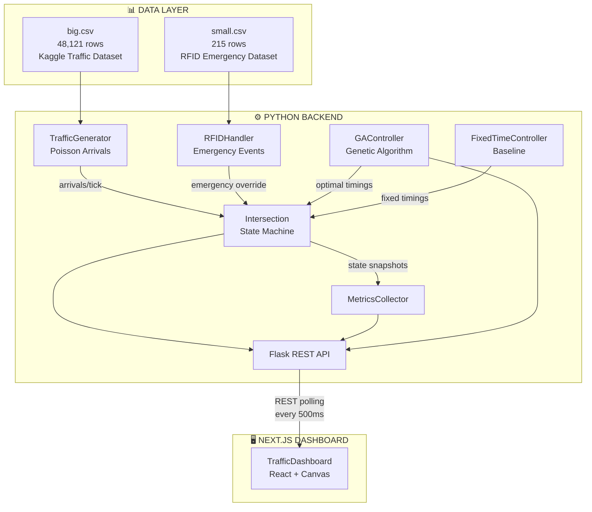
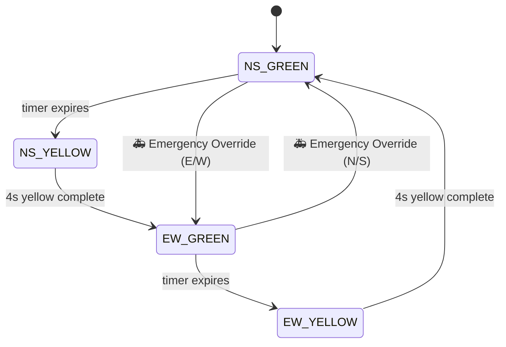

# Evolutionary Traffic Signal Control — System Architecture

> Complete technical reference for the ATSC (Adaptive Traffic Signal Control) system using a Genetic Algorithm.

---

## 1. High-Level System Diagram



---

## 2. The Two Datasets

### Dataset 1: Macro-Flow Volume (`big.csv`)

| Property | Value |
|----------|-------|
| **Source** | Kaggle — "Traffic Prediction Dataset" |
| **Size** | 48,121 hourly observations |
| **Columns** | `DateTime`, `Junction`, `Vehicles`, `ID` |
| **Mapping** | Junction 1→N, Junction 2→S, Junction 3→E, Junction 4→W |
| **Usage** | Averaged by hour (0–23) per junction to create a **24-hour volume profile** |

The system computes mean vehicles/hour/direction across the entire dataset, giving realistic traffic patterns — morning rush spikes (7–9 AM), afternoon peaks (4–6 PM), and midnight calms (1–4 AM). These volumes feed a **Poisson process** that generates stochastic per-tick arrivals:

```
λ = (hourly_volume × DEMO_MULTIPLIER / 3600) × tick_duration
arrivals = Poisson(λ)
```

### Dataset 2: Micro-Control RFID Events (`small.csv`)

| Property | Value |
|----------|-------|
| **Source** | "Traffic Signal Control Dataset for Four-Way Intersections" |
| **Size** | 215 labeled scenarios |
| **Columns** | `Case No.`, `Road : 01`–`Road : 04`, `RFID Signal`, `Result` |
| **Key Variable** | `RFID Signal` (1 = emergency vehicle detected) |

The system calculates the **historical emergency probability** from the dataset (`emergency_rows / total_rows × 0.2`, capped at 2%). When triggered:
- The road column with highest density determines the **emergency direction**
- A **15-second green override** is applied to that direction immediately

---

## 3. The Genetic Algorithm — Complete Specification

### 3.1 Chromosome Representation

```
Chromosome = [NS_green_duration, EW_green_duration]
```

| Gene | Meaning | Range |
|------|---------|-------|
| Gene 0: `NS_green` | Green time for North/South phase | 10–60 seconds |
| Gene 1: `EW_green` | Green time for East/West phase | 10–60 seconds |

**Constraint**: Total cycle length ≤ 120 seconds (`NS + EW + 2 × YELLOW_DURATION`)

### 3.2 GA Parameters

| Parameter | Value | Purpose |
|-----------|-------|---------|
| Population Size | 30 | Number of candidate solutions per generation |
| Generations | 50 | Evolution cycles per optimization run |
| Selection | Tournament (k=3) | Pick 3 random individuals, keep the fittest |
| Crossover | BLX-α Blend (α=0.5) | Offspring genes sampled from expanded parent range |
| Crossover Rate | 0.80 | 80% chance of combining two parents |
| Mutation | Gaussian (σ=5.0) | Add N(0, 5) to each gene independently |
| Mutation Rate | 0.10 | 10% chance per gene per individual |
| Elitism | Top 2 | Best 2 individuals copied unchanged to next generation |
| Evaluation Cycles | 2 | Fitness simulates 2 full signal cycles ahead |
| Evolution Interval | Every 20 sim-seconds | How often the GA re-optimizes |

### 3.3 Population Initialization (Smart Seeding)

The initial population of 30 individuals is created as:

1. **Slot 0 — Warm Start**: Copy of the previous best chromosome (carry forward past learning)
2. **Slot 1 — Demand-Proportional**: Green time split proportionally to current NS vs EW queue sizes
3. **Slots 2–29**: Random chromosomes uniformly sampled from [10, 60]

### 3.4 Fitness Function

```
f(chromosome) = 1 / (1 + cost)
```

Where `cost` is computed by a **continuous fixed-horizon residual-queue simulation** over exactly 120 seconds. This ensures fair comparison by exposing every candidate chromosome to the exact same total traffic volume:

```python
time_elapsed = 0.0
while time_elapsed < 120.0:
    for phase in [NS_Green, NS_Yellow, EW_Green, EW_Yellow]:
        step = min(phase_duration, 120.0 - time_elapsed)
        
        # Add arrivals during this step
        ns_queue += arrival_rate * step * ns_demand_ratio
        ew_queue += arrival_rate * step * ew_demand_ratio
        
        # Clear vehicles if it's a green phase
        if phase is Green:
            cleared = min(queue + recent_arrivals, SATURATION_FLOW_RATE * step * 2)
            queue -= cleared
            
        time_elapsed += step
        if time_elapsed >= 120.0: break

cost = total_residual + 0.3 × imbalance
```

**Key terms**:
- **`total_residual`**: Vehicles still queued after all cycles — the primary optimization target
- **`imbalance`**: Penalty when green allocation doesn't match demand ratio (e.g., 80% NS demand but only 30% NS green)
- **`SATURATION_FLOW_RATE`**: 0.5 vehicles/second/approach (1 car every 2 seconds headway)
- **`YELLOW_DURATION`**: 4 seconds per phase transition
- **`cycle_time`**: `NS_green + EW_green + 2 × 4s`

### 3.5 Genetic Operators

**Tournament Selection** (k=3):
```
Pick 3 random individuals → return the one with highest fitness
```

**BLX-α Blend Crossover** (α=0.5):
```
For each gene:
    lo = min(parent_a[i], parent_b[i])
    hi = max(parent_a[i], parent_b[i])
    span = hi - lo
    child[i] ~ Uniform(lo - 0.5×span, hi + 0.5×span)
```
This allows children to explore slightly *beyond* parent gene ranges — better for continuous optimization than single-point crossover.

**Gaussian Mutation** (σ=5, rate=10%):
```
For each gene with 10% probability:
    gene += N(0, 5)
Then clamp to [10, 60] and enforce cycle constraint
```

---

## 4. Intersection State Machine



**Key physics**:
- Discharge rate: `0.5 veh/s` per approach (2 approaches green simultaneously)
- Each tick = 0.1s real time × 10x speed = 1 simulated second
- Fractional vehicles tracked with accumulators (only whole vehicles leave)

---

## 5. Backend ↔ Frontend Communication

| Endpoint | Returns | Poll Rate |
|----------|---------|-----------|
| `GET /state` | Current lights, queues, timings, stats, emergency status | 500ms |
| `GET /metrics` | Aggregated wait time, throughput, queue stats | On demand |
| `GET /metrics/queues` | Queue length time series per direction | On demand |
| `GET /config` | Controller mode, GA parameters | On demand |
| `GET /history` | GA evolution log (fitness + timings per generation) | On demand |

**Architecture**: Two separate backend processes run simultaneously:
- **Port 5000**: GA Controller (evolves timings every 20 sim-seconds)
- **Port 5001**: Fixed-Time Controller (static 30s/30s baseline)

The frontend polls both and displays them side-by-side for live comparison.

---

## 6. Why GA Beats Fixed-Time

| Scenario | Fixed-Time (30s/30s) | GA (Adaptive) |
|----------|---------------------|---------------|
| Balanced traffic (N=S=E=W) | ✅ Optimal by coincidence | ✅ Converges to ~30/30 |
| NS-heavy rush hour | ❌ Wastes 30s on empty EW | ✅ Evolves to ~45/15 |
| Sudden demand shift | ❌ Oblivious | ✅ Re-evolves every 20s |
| Emergency vehicle | ✅ Both handle overrides | ✅ Both handle overrides |

The GA's advantage is **reactive proportional allocation** — it evolves green time to match real-time demand ratios, reducing both queue buildup and average wait time.

---

## 7. Key Constants Reference

| Constant | Value | File |
|----------|-------|------|
| `SATURATION_FLOW_RATE` | 0.5 veh/s | `vehicle_physics.py` |
| `YELLOW_DURATION` | 4 seconds | `vehicle_physics.py` |
| `MIN_GREEN` | 10 seconds | `vehicle_physics.py` |
| `MAX_GREEN` | 60 seconds | `vehicle_physics.py` |
| `MAX_CYCLE_LENGTH` | 120 seconds | `vehicle_physics.py` |
| `TICK_DURATION` | 0.1 seconds | `main.py` |
| `SIM_SPEED_MULTIPLIER` | 10x | `main.py` |
| `GA_EVOLVE_INTERVAL` | 20 sim-seconds | `main.py` |
| `DEMO_VOLUME_MULTIPLIER` | 5x | `traffic_generator.py` |
| `EMERGENCY_OVERRIDE_DURATION` | 15 seconds | `rfid_handler.py` |
